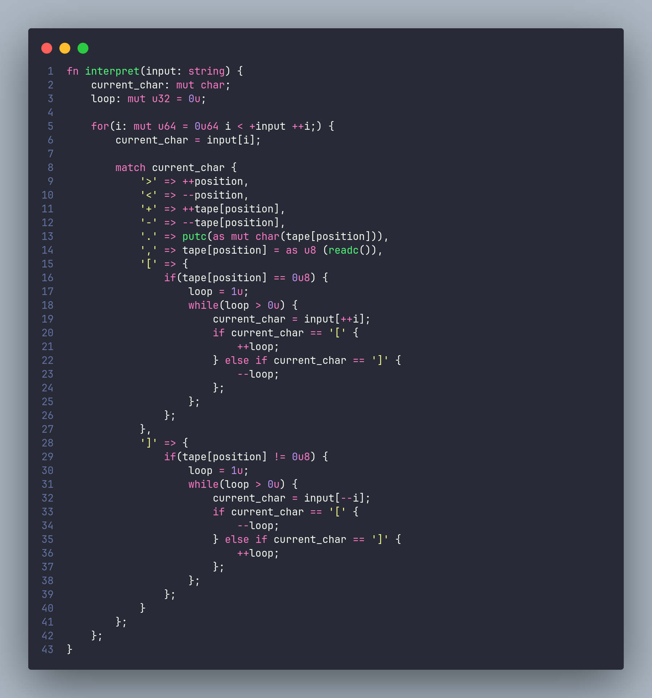

# Linc Language: Linc Is Not C

*Disclaimer: Everything demonstrated is a Work In Progress (W.I.P), so the language is bound to undergo changes; some minor, some not so much.
Linc is a general-purpose programming language inspired by C.
Here are some of its key characteristics:

- **Statically typed:** Linc's static typing ensures that every value's purpose is respected, such that it be used accordingly.
- **Multi-paradigm:** It is a priority that the language support multiple coding-paradigms, in order to appeal to not only *Functional* programming audiences, but also *Object Oriented* and *Procedural* ones.
- **Modern:** Linc is focused on the future, rather than maintaining old habits that arose from past technical limitations. The syntax and feel of the language aim to reflect that.
- **Library neutral:** Many languages enforce library specific features on the language level, which includes favoring some function names and identifiers over others. This, more often than not, forces specific design choices on the user, which can be limiting. In linc, not only is this not the case, but also all operators are sequences of symbols; no exceptions for 'special' identifiers.
- **Expressive:** A problem with many low-level languages is the lack of expressiveness. This is understandable, due to a focus on performance and compile-time efficiency, deeming them top priorities. In Linc, the language is designed to maximize expressiveness, while not making sacrifices on binary performance.

### Screenshot showcasing how the language feels.

For more, look into [examples](./examples/).



## Features

- **Immutability by default:** In the majority of modern programming languages, a variable is declared mutable unless stated otherwise (most commonly achieved using the 'const' keyword). In linc, as well as a few other functional-inspired programming languages (such as Rust), the opposite is true. This serves the purpose of easing-up const-correctness (it's much more difficult to specify const, when most of the time it makes sense as the default, rather 'opting-in' for mutability on a case-by-case basis).
- **Interpreted Shell:** Although the language is far from 'complete', one can experiment with language features and the language in general, whether by interpreting and evaluating files, or by using the Linc shell (`lincev`), which allows code to be written in a REPL environment.
- **Compiler:** The `lincc` compiler backend is experimental and in development, and supports basic Linc syntax. It's currently not very stable, but is undergoing development. It currently only supports GNU/Linux + x86-64 targets.

## Requirements

This project uses some well established tools to function. Those include:

- CMake 3.16 (or newer version).
- A CMake generator (such as GNU Make or Ninja).
- Git (necessary so as to clone the repository, archive .zip downloads are highly discouraged).
- A terminal emulator that supports ANSI escape sequences.
- A C++ compiler with standard C++ 23 support.
- lincc additionally depends on `nasm` as well as `ld` for producing valid binaries.
The tools mentioned must be available in the $PATH environment variable, in order to be usable inside of the shell properly.

## Compiling

To start compiling this project, you must first clone the GitHub repository recursively (using the shell of your choice):

```sh
git clone --recursive https://github.com/fosspointer/linc
```

You can then use the provided `install.sh` script to install Linc to your system (or `build.sh` to build it locally).

### Linux and Unix-based systems

- In order to ease the compilation process, the shell scripts *build.sh* and *install.sh* have been provided. Those can be used for building and installing the project's binaries respectively.

- Use the provided build scripts. Beware that they support Ninja and GNU Make, meaning that for all other targets, CMake must be invoked manually instead. 

### Windows

Changes have been made to support Microsoft Windows, for which the project is functional. Windows does receive specialized testing, though to a lesser extent than GNU/Linux. However, it is not the main environment used to develop and test the language, and any Windows specific problems might not receive fixes quickly. All windows testing has been done under MSYS2, MinGW-w64 (UCRT) and Ninja.

## Miscellaneous

- See the [changelog](./changelog.md) for newest additions and next updates.
- A [guide](./guide/0-getting_started.md) is provided for those interested in learning the Linc language. It assumes minimal programming experience.